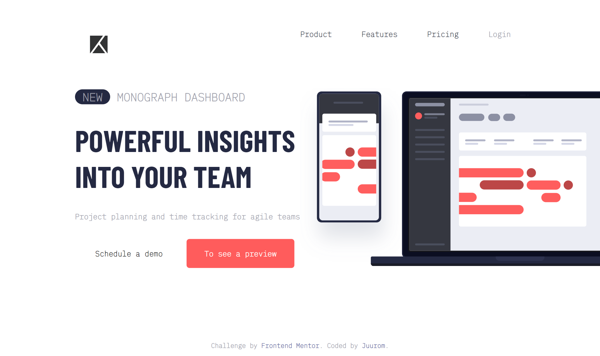
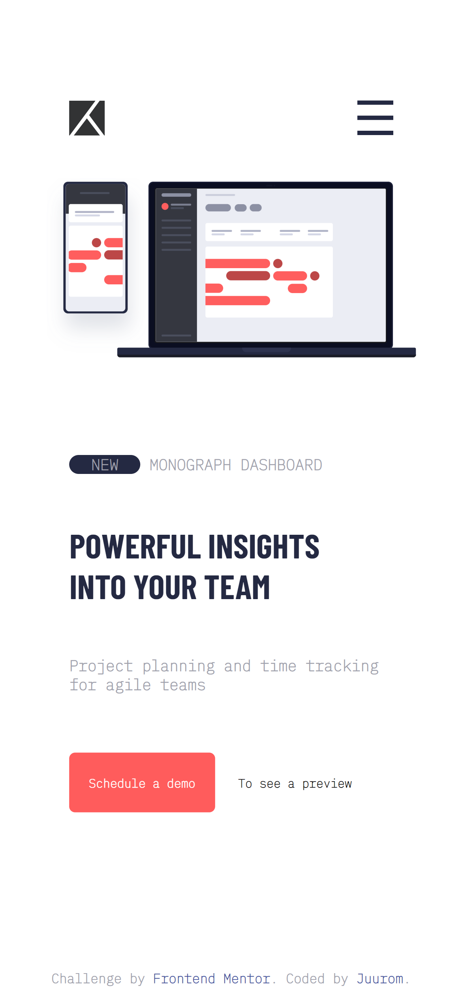
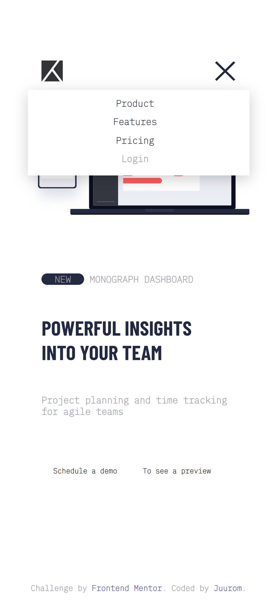

# Frontend Mentor - Project tracking intro component solution

이 솔루션은 [Project tracking intro component challenge on Frontend Mentor](https://www.frontendmentor.io/challenges/project-tracking-intro-component-5d289097500fcb331a67d80e) 챌린지 참여 결과물입니다.

## 차례

- [소개](#소개)
  - [챌린지](#챌린지)
  - [화면 스크린샷](#화면-스크린샷)
  - [링크](#링크)
- [배운 점](#배운-점)
  - [사용 tool](#사용-tool)
  - [새롭게 배운 것](#새롭게-배운-것)
  - [앞으로 배울 것](#앞으로-배울-것)
  - [참고 사이트](#참고-사이트)
- [제작자](#제작자)
- [기타사항](#기타사항)

## 소개

### 챌린지

스케줄 관리를 도와주는
가상의 웹사이트의 메인 페이지를 만들었다.
화면 크기에 따라 구성이 다르게 보이는
반응형 웹으로 만들었다.

### 화면-스크린샷






### 링크

- Solution URL: [Github](https://github.com/juurom/Track___frontendMentor/)
- Live Site URL: [Live Site](https://juurom.github.io/Track___frontendMentor/)

## 배운-점

### 사용-tool

- HTML
- CSS

### 새롭게-배운-것

1. transition

hover시에 색상이 서서히 변하는 효과를 알게 되었다.
transition: property timing-function duration delay | initial | inherit
- property: transition을 적용시킬 속성
- timing-function: transiton의 진행 속도
- duration: transition의 총 시간
- delay: transition의 시작 연기
- initial: 기본값
- inherit: 부모 요소 상속

CSS
```css
button:hover{
    background-color: hsl(0, 100%, 68%);
    color:rgb(255,255,255);
    transition: background-color 0.5s ease-in-out;
}
```

2. 선택자

div a와 div b가
서로 형제 관계(같은 부모 선택자를 공유함)일 때에는 '~',
서로 부모 - 자식 관계일 때에는 '>'로 선택한다.

직접 사용한 부분은 다음과 같다.
HTML
```html
<div class="menulogo"></div>
<div class="right">
  <div class="menu"></div>
</div>
```
CSS
```css
    .menulogo:hover ~.right>.menu{
        height: 120px;
        width: 100%;
        display: block;
        background-color: rgb(255,255,255);
        box-shadow: 0 5px 20px rgba(0, 0, 0, 0.2);
        margin-top: 15vh;
    }
```

3. 가로로 나란히 정렬된 요소를 세로로 정렬하기

부모 요소의 display: flex를 통해 자식 요소들을 flex로 만들어준 뒤
flex-wrap: wrap으로 해서 자식 요소들이 부모 요소보다 길어질 때
줄바꿈을 하도록 했다.
이때 각 자식 요소의 width는 100vw로 해서,
한 줄에 하나의 자식 요소가 들어올수 있도록 했다.
만약 가로로 정렬했던 자식 요소가
세로로 정렬되면서 순서가 뒤죽박죽으로 섞인다면,
order를 통해 순서를 맞게 해 준다.

CSS
```css
    .wrap{
        display: flex;
        flex-wrap: wrap;
    }
    .left{
        order:4;
        width: 100vw;
        padding: 0 15%;
    }
    .right{
        order:3;
        width: 100vw;
        margin:0;
        padding: 0 10vw;
        text-align: center;
    }
```

### 앞으로-배울-것
css는 이제... 못하는 건 없는 것 같다 후후 나한테 다맡겨
~~는 빈 깡통이 제일 요란하다더니^^~~
구글링해서 자료를 찾아 보면 대부분의 문제를 해결할 수 있는 것 같다.
자바스크립트 등으로 내부 로직을 구성하는 연습이 더 필요할 것 같다.

### 참고-사이트

- [transition](https://www.codingfactory.net/10953) - transition에 관한 정리이다.

## 제작자

- Github - [@juurom](https://github.com/juurom/)
- Frontend Mentor - [@yourusername](https://www.frontendmentor.io/profile/juurom)

## 기타사항
사실 주말동안 리액트를 찍먹해봐서
배운 걸로 fe mentor 과제 하나를 해결해보려고 했다.
해결하려고 했던 과제는
toggle 버튼에 따라 서로 다른 가격 플랜을 보여주는 페이지였다.
그런데... 그런데... toggle버튼에 따라서 요소를 보여주었다 보이지 않게 했다 하는 것이 너무 어려워서
일단 던져두고 할 수 있는 html, css 공부했다.
이제 한개 만들었으니 다시 리액트 공부하러... 총총
